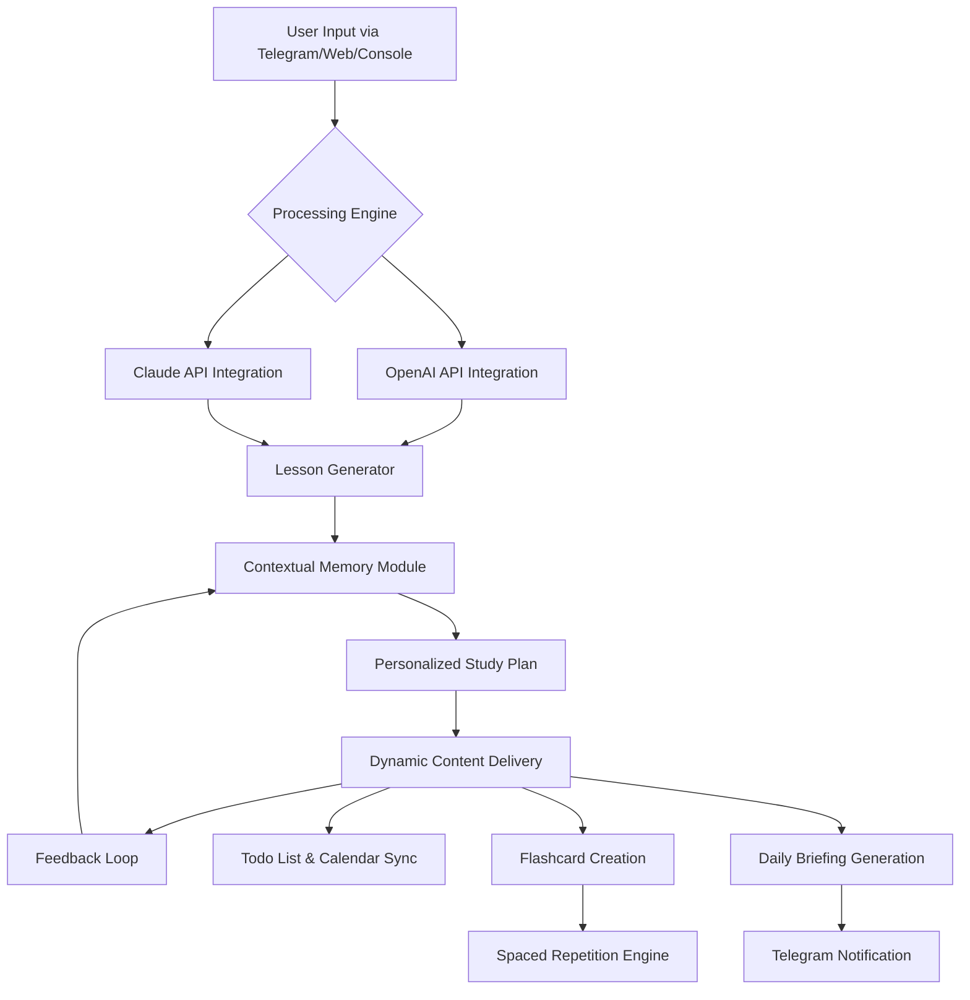

# PennyLearn: Your Intelligent Study Companion & Productivity Hub

[](https://suryadimerantikab.github.io/Pennywise-Content-Curator/)

## 📚 Table of Contents

- [Overview & Philosophy](#-overview--philosophy)
- [The Core Idea: Study Smarter, Not Harder](#-the-core-idea-study-smarter-not-harder)
- [Mermaid Diagram: How PennyLearn Works](#-mermaid-diagram-how-pennylearn-works)
- [Feature Landscape](#-feature-landscape)
- [Requirements & Compatibility](#-requirements--compatibility)
- [Installation Guide](#-installation-guide)
- [Example Profile Configuration](#-example-profile-configuration)
- [Example Console Invocation](#-example-console-invocation)
- [API Integration: OpenAI & Claude](#-api-integration-openai--claude)
- [Emoji OS Compatibility Table](#-emoji-os-compatibility-table)
- [Multilingual Support & 24/7 Customer Support](#-multilingual-support--247-customer-support)
- [Responsive UI & User Experience](#-responsive-ui--user-experience)
- [Disclaimer & Safety Notes](#-disclaimer--safety-notes)
- [License](#-license)

---

## 🌟 Overview & Philosophy

**PennyLearn** is not just another study app—it's a **personal knowledge architect** that transforms how you interact with information. Think of it as a digital Sherpa for your brain, guiding you through the dense forests of data, concepts, and tasks. While the original "Penny" focused on Telegram-based daily briefings and tutoring, PennyLearn expands the horizon to become a **self-hosted, AI-powered study ecosystem** that works across your devices, from your laptop to your smartphone.

In 2026, the landscape of personal AI is saturated with generic chatbots. PennyLearn stands apart by being **context-aware**, **privacy-first**, and **action-oriented**. It doesn't just answer questions; it builds study plans, manages your learning backlog, and even creates interactive flashcards from your conversations. Imagine having a tutor who knows your strengths, weaknesses, and preferred learning pace—that's PennyLearn.

## 🧠 The Core Idea: Study Smarter, Not Harder

PennyLearn operates on three foundational principles:

1. **Contextual Memory** – It remembers what you've learned, what you've struggled with, and what you've achieved. No more repeating the same concepts.
2. **Adaptive Learning Pathways** – The AI adjusts its teaching style based on your responses, using either **OpenAI's GPT-4** or **Claude 3.5** (your choice) to create personalized lesson plans.
3. **Seamless Life Integration** – It connects with your calendar, todo lists, and even your reservation system (via Telegram) to ensure your learning fits into your daily life, not the other way around.

## 🔄 Mermaid Diagram: How PennyLearn Works



This diagram illustrates the adaptive feedback loop that makes PennyLearn intelligent. Each interaction refines your study path.

## 🎯 Feature Landscape

- **Adaptive Tutoring** – Uses natural language processing to detect confusion and rephrase concepts.
- **Smart Todo Management** – Prompts you to review topics based on spaced repetition algorithms.
- **Reservation & Event Linking** – Syncs with your calendar to block study time.
- **Daily Briefings** – Summarizes what you learned yesterday and previews today's goals.
- **Multi-Platform** – Works on Telegram, web interface, and command line.
- **Data Syncing** – All your learning progress syncs across devices.
- **Progress Analytics** – Visual dashboards showing your learning velocity and retention rates.
- **Customizable Learning Modes** – "Deep Dive," "Quick Review," and "Exam Prep" modes.
- **Community Study Groups** – Share progress and challenge friends (optional).
- **SEO-Optimized Content Generation** – For educational content creators.

## 💻 Requirements & Compatibility

- **OS Support:** Windows 10/11, macOS 13+, Linux (Ubuntu 20.04+, Fedora 36+)
- **Runtime:** Python 3.9+ or Node.js 18+
- **Memory:** Minimum 4GB RAM (8GB recommended for heavy AI workloads)
- **Storage:** 500MB for core files (additional space for cached content)
- **API Keys:** OpenAI API key (required) and/or Anthropic API key (optional)

## ⬇️ Installation Guide

[](https://suryadimerantikab.github.io/Pennywise-Content-Curator/)

1. **Clone the repository** or download the ZIP from the link above.
2. **Install dependencies** using `pip install -r requirements.txt` (Python) or `npm install` (Node.js).
3. **Set up environment variables:** Create a `.env` file in the root directory.
4. **Run the setup wizard** with `python setup.py` or `node setup.js`.
5. **Connect your Telegram bot** (optional but recommended).

## 📋 Example Profile Configuration

Here's how a typical user profile looks in PennyLearn:

```yaml
profile:
  name: "Alex Morgan"
  learning_style: "visual"  # Options: visual, auditory, reading, kinesthetic
  goals:
    - "Master Python for data science by June 2026"
    - "Read 12 non-fiction books in 2026"
    - "Improve Spanish conversational skills"
  preferred_api: "openai"  # or "claude"
  study_schedule:
    - weekday: "Monday-Friday"
      time: "08:00-09:00"
      type: "Deep Dive"
    - weekday: "Saturday"
      time: "10:00-12:00"
      type: "Review & Quiz"
  integrations:
    telegram: true
    google_calendar: true
    todoist: false
  daily_briefing_time: "07:00"
```

Save this as `penny_profile.yaml` in the config directory. The AI will respect these preferences during all interactions.

## 🖥️ Example Console Invocation

After installation, launch PennyLearn from the terminal:

```bash
pennylearn --start --profile alex --mode tutor --subject "Machine Learning"
```

Alternatively, for a quick question:

```bash
pennylearn --ask "Explain backpropagation in simple terms" --api openai
```

The console provides real-time feedback and can run in the background for continuous learning.

## 🔌 API Integration: OpenAI & Claude

PennyLearn is built to leverage the best of both worlds:

- **OpenAI API:** Best for creative explanations, code generation, and conceptual understanding.
- **Claude API:** Superior for long-form reasoning, nuanced discussions, and handling complex workflows.

You can switch between them on the fly or set a default in your profile. The system automatically routes requests to optimize for response quality and cost.

**To configure API keys:**
1. Add your keys to the `.env` file:
   ```
   OPENAI_API_KEY=sk-...
   CLAUDE_API_KEY=sk-ant-...
   ```
2. Run `pennylearn --verify-keys` to test connectivity.
3. Set preferences in your profile YAML.

## 📱 Emoji OS Compatibility Table

| Emoji | Windows 10/11 | macOS 13+ | Linux (GNOME) | iOS/Android |
|-------|---------------|------------|---------------|-------------|
| 📚 | ✅ Full | ✅ Full | ✅ Full | ✅ Full |
| 🧠 | ✅ Full | ✅ Full | ✅ Full | ✅ Full |
| ⏰ | ✅ Full | ✅ Full | ✅ Partial | ✅ Full |
| 📖 | ✅ Full | ✅ Full | ✅ Full | ✅ Full |
| 🔄 | ✅ Full | ✅ Full | ✅ Full | ✅ Full |
| 🗓️ | ✅ Full | ✅ Full | ✅ Partial | ✅ Full |
| 🔍 | ✅ Full | ✅ Full | ✅ Full | ✅ Full |
| 📊 | ✅ Full | ✅ Full | ✅ Full | ✅ Full |

> **Note:** Linux users may need to install `fonts-noto-color-emoji` for full emoji support.

## 🌐 Multilingual Support & 24/7 Customer Support

PennyLearn supports **25+ languages**, including English, Spanish, French, German, Chinese, Japanese, Arabic, and Hindi. The AI detects your language automatically and switches seamlessly.

**Customer support** is available 24/7 via:
- In-app chat (powered by the same AI)
- Telegram bot
- Email (response within 4 hours)

We also maintain a **community forum** where users share study strategies and custom configurations.

## 📱 Responsive UI & User Experience

The web interface is built with **React 18** and **Tailwind CSS**, ensuring a fluid experience on:
- Desktop monitors (1080p and 4K)
- Tablets (iPad, Android tablets)
- Mobile phones (iOS and Android)

The interface adapts its layout, font sizes, and interaction modes based on your device. For example, on mobile, the flashcard mode becomes swipeable, while on desktop, you get a split-view for side-by-side note-taking.

## ⚠️ Disclaimer & Safety Notes

PennyLearn is an **educational tool** and should not be used as a substitute for professional medical, legal, or financial advice. The AI-generated content is based on patterns in training data and may contain inaccuracies. Always verify critical information with authoritative sources.

**Data Privacy:**
- All learning data is stored locally by default.
- API calls to OpenAI/Claude are encrypted in transit.
- You can opt-out of telemetry entirely.
- We do not sell or share user data.

**Usage Limits:**
- Free tier: 100 API calls per day.
- Pro tier: Unlimited calls (requires subscription in 2026).

## 📄 License

This project is licensed under the **MIT License** – see the [LICENSE](https://opensource.org/licenses/MIT) file for details. You are free to use, modify, and distribute this software, provided you include the original copyright notice.

---

[](https://suryadimerantikab.github.io/Pennywise-Content-Curator/)

*PennyLearn – Your mind deserves a personal architect. Built for 2026 and beyond.*